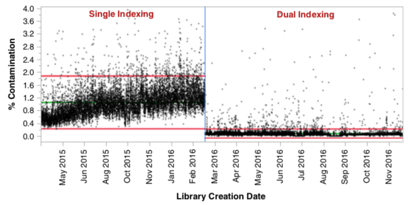
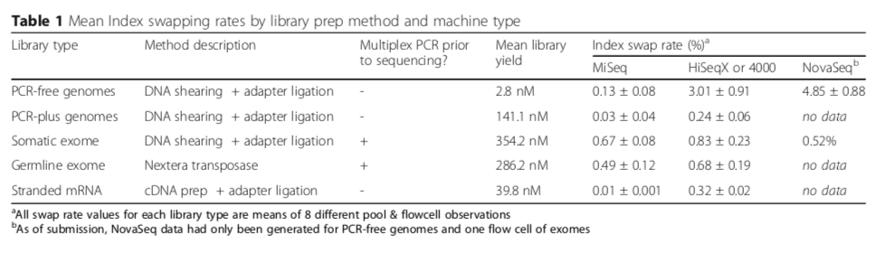
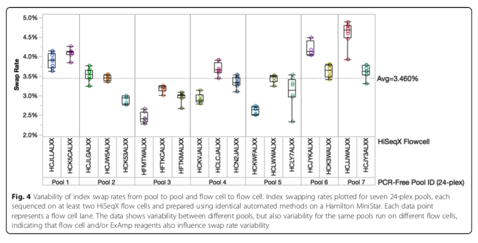
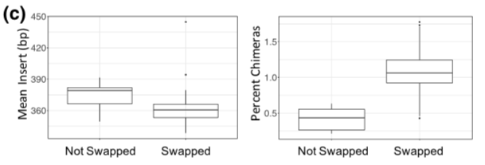
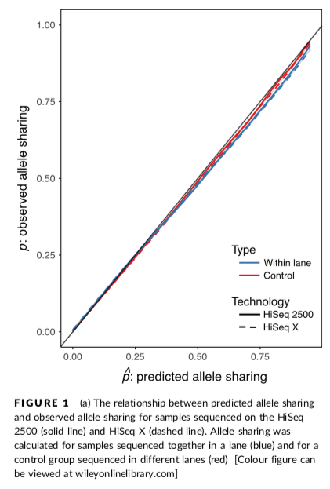
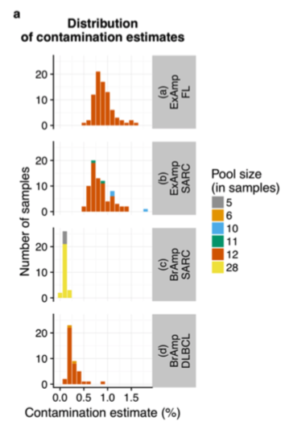
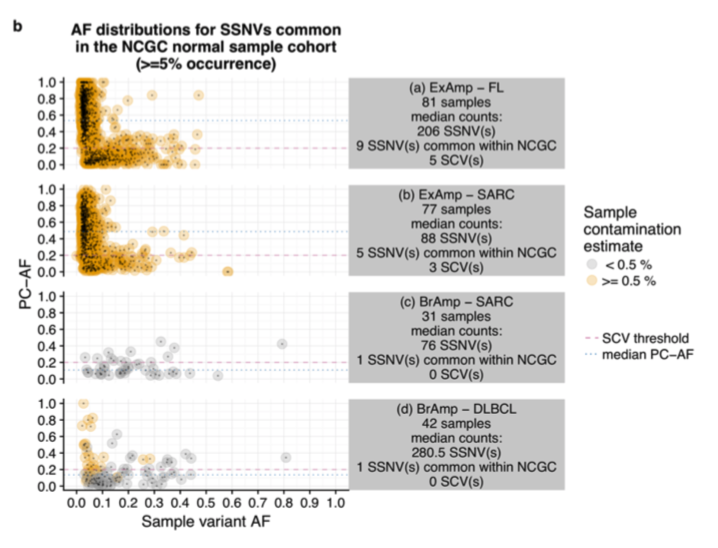

# Index Hopping Analysis

__[Characterization and remediation of sample index swaps by non-redundant dual indexing on massively parallel sequencing platforms](https://bmcgenomics.biomedcentral.com/articles/10.1186/s12864-018-4703-0)__

_Costello et al._ - [10.1186/s12864-018-4703-0](https://doi.org/10.1186/s12864-018-4703-0)

* HiSeq X, 3000/4000 utilize a patterned flowcell.
* The patterned flowcell has been observed to cause higher levels of index swapping. The patterned flowcell ustilizes ExAmp chemistry to provide higher yields, but this also contributes to greater levels of swapping because adapters/primers are not washed away as they are on HiSeq 2500.

<small>Single indexing was obsered to cause greater levels of contamination</small>

PCR-plus - 8 Extra cycles

### Factors contributing to swapping

The authors in this paper identified several factors that contribute to increased rates of swapping.

- Presence of excess free primer or adapters
- Increases as plex increases. Prob(self-swaps) decreases, and prob of swaps with other samples increases.
- Library prep method influences swap rates with DNA shearing + adapter ligation + HiSeq - Highest rates
- Higher rates observed for chimeric reads.
- Higher rates at lower % GC, b/c shorter fragments with lower %GC amplify more efficiently with polymerase based amplification assays - which is what the ExAmp chemistry ustilizes.
- Swapping also occurs during exome capture

- "Index switching causes spreading of signal" paper reported 10% swap rate.
- Highest found in this paper is 6%.
- Typical swap rates:
  - 3% - PCR- (free)
  - 0.25% - PCR+ genomes.
- Authors hypothesize higher swap rates in PCR-free libraries due to low library fragment yield. This is likely due to the dilution step.
- PCR-plus libraries are diluted following PCR, reducing the ratio of adapter to library fragments.
- They hypothesize that the dilution of PCR-plus libraries reduces the ratio of free adapter to library fragments.
- Index swapping examined at the flowcell - lane level.
- Observed rates of 0.2 - 6%, avg. 1%
- In the case of WES, most adapters would be lost during the exome capture stage, and PCR further reduces likelihood of swapping.
- Swapping is therefore more of an issue with WGS without adequite cleanup.

<small>Swap rates are examined on a per-lane per-flowcell basis</small>

<small>Both smaller inserts and chimeras have increased swap rates</small>

__[A novel post hoc method for detecting index switching finds no evidence for increased switching on the Illumina HiSeq X](https://onlinelibrary.wiley.com/doi/full/10.1111/1755-0998.12713)__

_Owens et al._

Examines unbalanced heterozygoes which would be produced by index switching.

* Working with WGS sunflower (_Helianthus annuus).
* 350 bp size.
* Prob. is that only a single read is observed to switches in their dataset. 
* Calculated the bionomial probability that the rare allele would be found in one or more samples based on the allele frequency for all samples sequenced with that machine.

$\hat{p} = 1 - (1-f)^{2n}$

If index switching is occuring, then $\hat{p} > p$.

__[Occult Specimen Contamination in Routine Clinical Next-Generation Sequencing Testing](https://academic.oup.com/ajcp/article/144/4/667/1767338)__

_Sehn et al._

* Examined haplotypes to identify contamination.
* Developed a list of 200 pairs of closely spaced SNPs.
  * Within 400 bp of one another
  * Population minor allele $frequency > 0.1$
  * $r^2 < 0.5$
  * $HWE \geq 0.05$
* Contamination estimated as $2x$ the mean frequency of the minor haplotype at multihaplotype loci to correct for zygosity (???).

__[Sample-Index Miasassignment Impacts Tumour Exome Sequencing](https://www.nature.com/articles/s41598-018-23563-4)__

_Vodak et al._

* [Git repo]()

* "index misassignment is a source of false positive somatic variant calls in a form of true variation obtained from co-multiplexed samples."

* Performed deep exome sequencing; Median coverage: 315x Tumor; 146x control. Compared HiSeq 2000/2500 and HiSeq 4000 (ExAmp).
* Measured sample-wise contamination using Conpair.
* Simulations suggest conpair underestimates contamination rates with increasing sample counts.
* __Conpair__ is designed for 2 sample mixtures only (supposedly)

### Contamination Estimates

Comparing ExAmp and Bridge amplification, they identify median per-sample rates:

* 0.839% with ExAmp
* 0.187% with Bridge Amplification

Examining samples that were sequenced as part of a pool or on their own revealed estimates of:

* 0.644% pooled (multiplexed)
* 0.046% in individual lanes

"The dependency on sample pooling indicated that co-multiplexed samples serve as contaminants."

### Artifactual variant calls

__SSNV__ = Somatic single nucleotide variants

* Examined the "pool complement" which consisted of reads from all co-multiplexed samples.
* Calculated two allelic fractions for each somatic variant:
  * __PC-AF__ - "Pool Complement" allelic fraction; Allelic fraction in the source of contamination.
  * __AF__ - Allelic fraction in a sample variant suspected of contamination.

Two distinct classes of variants identified from resulting analysis:

1. Apparently true somatic variants consisting of variants not present in the Norwegian population, and lacking support in the pool complement.
2. Suspected contaminant variants, consisting of __common Norwegian Germline Variants__ with >= 5% allele frequency, with considerable support in their pool complements. 

__[Conpair: concordance and contamination estimator for matched tumor–normal pairs](https://academic.oup.com/bioinformatics/article-abstract/32/20/3196/2196627)__

_Bergmann et al._

* [github](https://github.com/nygenome/conpair)

* 
  
"Using a grid-search over a range of contamination fractions";

A _grid search_ is simply a parameter sweep or exhaustive search.

* VerifyBamID works well for __copy-neutral__ samples.